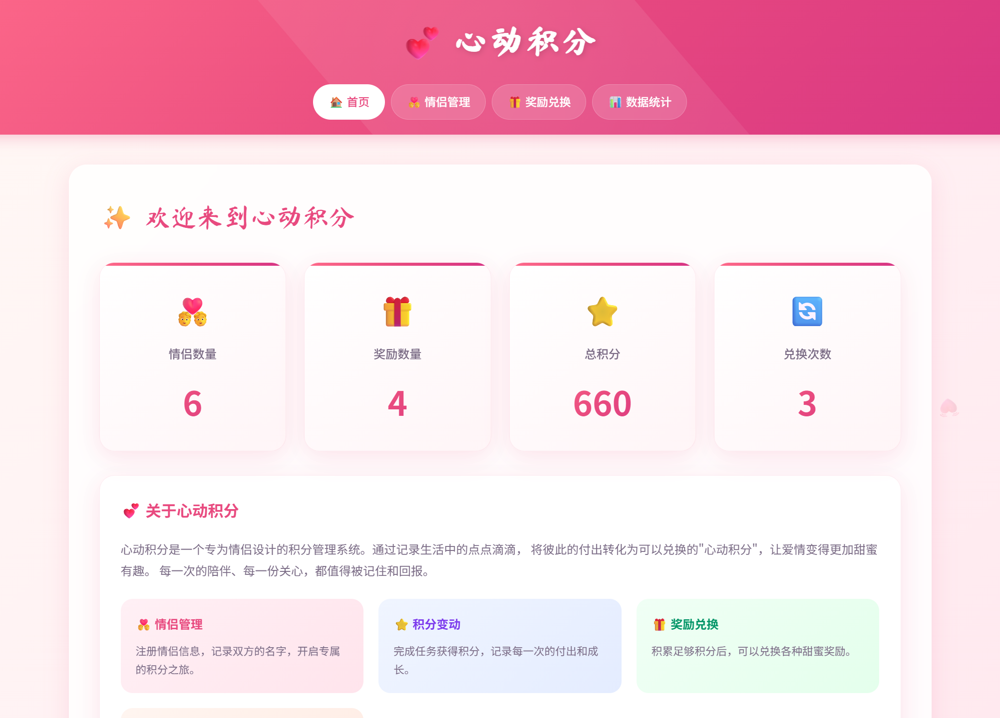
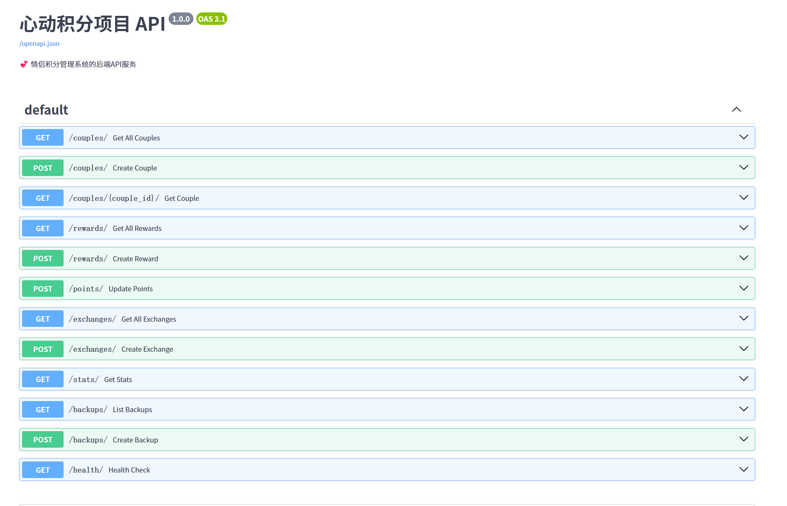
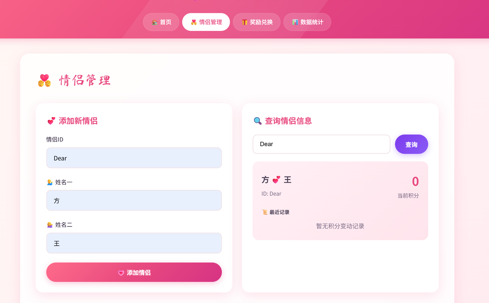
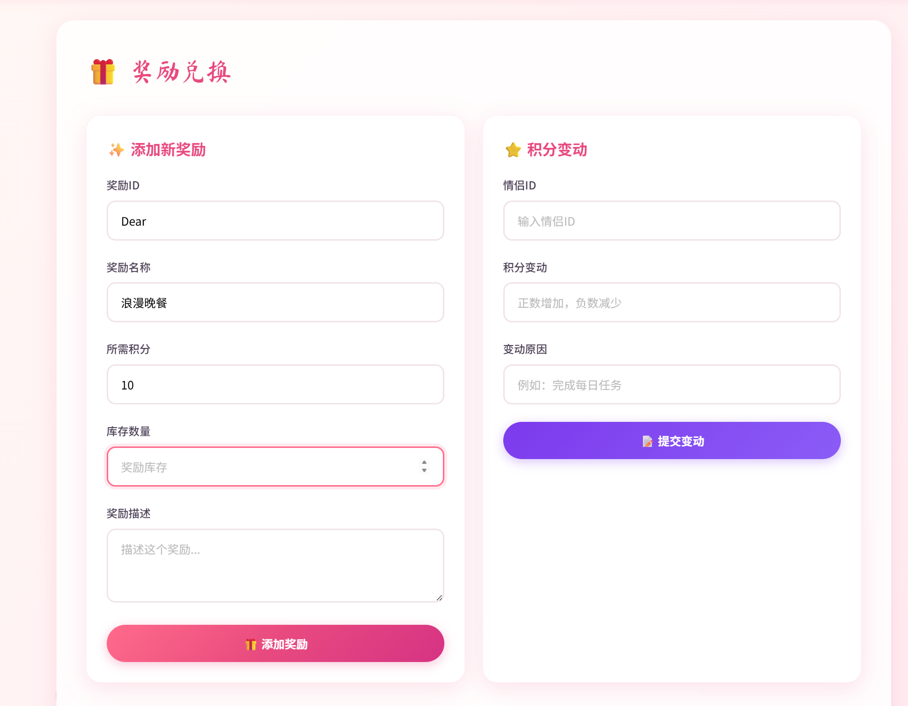
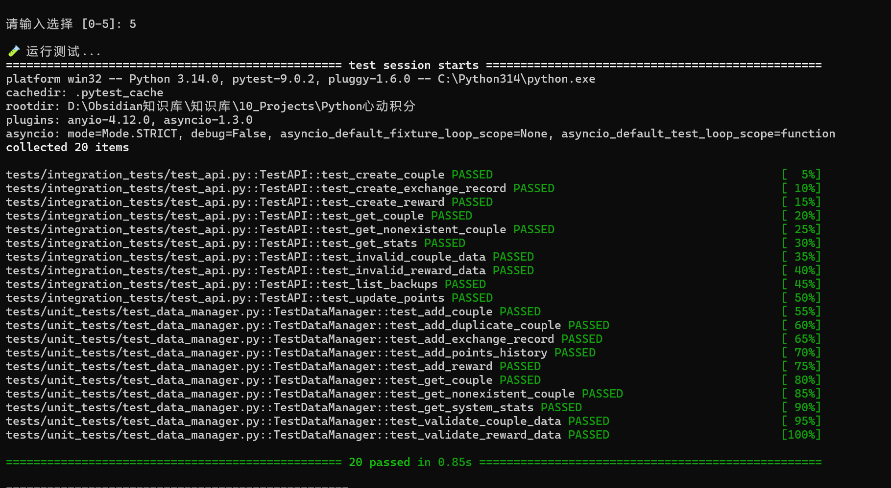
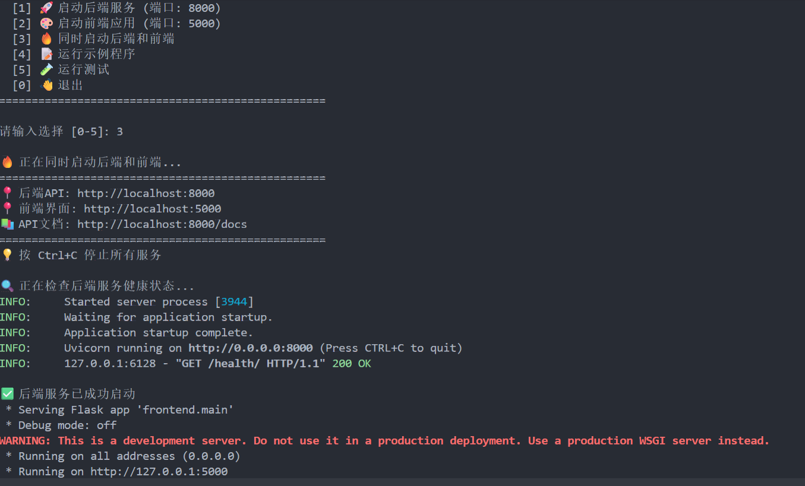
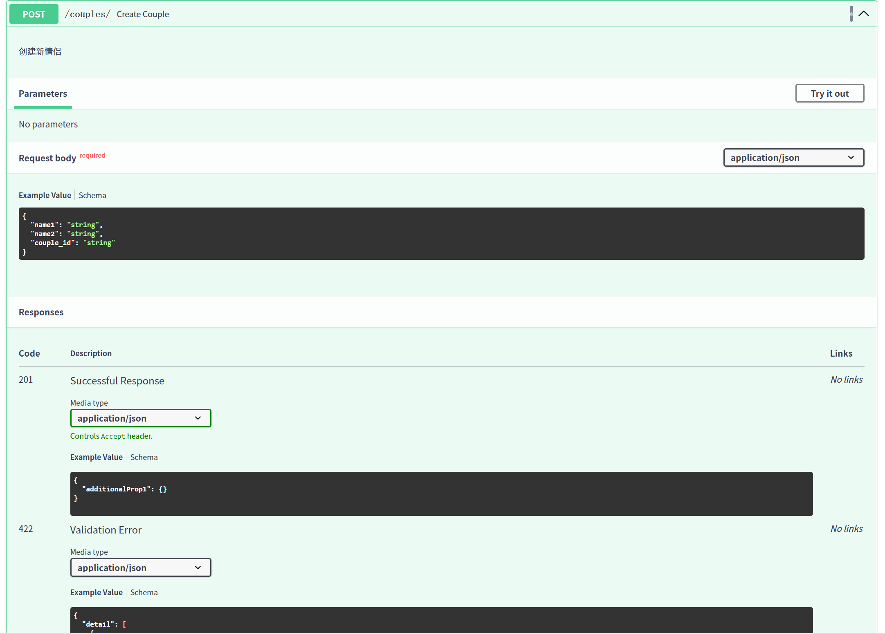

# “心动积分”项目期末报告

## 1. 项目概述

*   **项目名称:** 心动积分
*   **一句话简介:** 一个基于Web的积分记录与管理系统，旨在通过前后端分离的架构，提供清晰、稳定、可扩展的应用体验。
*   **目标用户/场景:** 主要面向需要记录和追踪某种“积分”或贡献度的情侣、家庭成员或小型团队。用户可以在Web界面上方便地增加、查询和管理积分，将情感或贡献量化，增加互动乐趣。
*   **主要功能亮点:**
    1.  **前后端分离架构:** 采用经典的Web开发模式，后端（FastAPI）负责数据和逻辑，前端（Flask）负责展示和交互，实现了团队成员的并行开发和技术解耦。
    2.  **稳健的系统集成:** 通过中央启动脚本，利用多线程和健康检查机制，确保了前后端服务在启动过程中的时序依赖和稳定性，有效避免了服务连接失败的问题。
    3.  **API驱动:** 所有的数据交互均通过标准化的API接口进行，前端作为纯粹的API消费者，保证了数据流的清晰和未来扩展的可能性（如开发移动端App）。
*   **个人角色与贡献:**
    在本项目中，我担任**系统架构师**和**集成开发工程师**的角色。主要贡献包括：
    1.  **设计了项目整体的前后端分离架构**，明确了各模块的技术选型和职责边界。
    2.  **开发了项目的中央控制脚本 (`main.py`)**，实现了对前后端两个独立模块的统一管理、一键启动和稳定集成。
    3.  **解决了系统集成中的核心技术难题**：通过引入多线程和健康检查机制，处理了前后端启动时序不一致可能导致的"竞态条件"问题，保障了系统的健壮性。

*   **项目运行效果展示:**

    图1-1展示了系统的Web前端界面，用户可以通过浏览器访问前端应用，查看系统统计信息、管理情侣账户、浏览奖励商城等。

    

    *图1-1：系统Web前端界面 - 首页仪表盘*

    图1-2展示了项目的启动入口。用户通过运行 `main.py` 脚本，可以访问系统主菜单，选择启动后端服务、前端应用，或同时启动两者。系统提供了友好的命令行交互界面，并包含测试、示例程序等功能入口。

    

    *图1-2：系统启动入口 - 主菜单界面*

## 2. 需求分析与功能清单

*   **核心需求:**
    1.  **情侣管理:** 提供创建情侣档案的功能，支持记录情侣双方的姓名，并为每对情侣维护独立的积分账户。
    2.  **积分系统:** 支持积分的增减操作，记录每次积分变动的原因和历史，方便追溯和统计。
    3.  **奖励商城:** 提供奖励商品管理功能，支持设置兑换所需积分和库存数量，让情侣可以用积分兑换实际的奖励。
    4.  **兑换记录:** 记录每次奖励兑换的信息，包括使用的积分、兑换的奖励等，形成完整的消费历史。
    5.  **数据统计:** 提供系统整体统计信息，包括情侣总数、奖励总数、总积分、兑换次数等，帮助了解整体使用情况。

*   **详细功能清单:**

    *   **后端 (Backend - FastAPI)**

        **情侣管理模块:**
        *   `POST /couples/`: 创建新的情侣档案，需要提供情侣ID和双方姓名。
        *   `GET /couples/{couple_id}/`: 获取指定情侣的详细信息，包括当前积分和历史记录。
        *   `GET /couples/`: 获取所有情侣的列表，用于展示和管理。

        **奖励管理模块:**
        *   `POST /rewards/`: 创建新的奖励商品，设置名称、所需积分、库存和描述。
        *   `GET /rewards/`: 获取所有可用奖励列表，供前端展示和兑换使用。

        **积分管理模块:**
        *   `POST /points/`: 更新情侣积分，支持增加或减少积分，并记录变动原因和历史。

        **兑换管理模块:**
        *   `POST /exchanges/`: 创建兑换记录，记录情侣使用积分兑换奖励的行为。
        *   `GET /exchanges/`: 获取所有兑换记录，用于历史查询和统计。

        **系统管理模块:**
        *   `GET /stats/`: 获取系统统计信息（情侣数、奖励数、总积分等）。
        *   `GET /backups/`: 列出所有数据备份文件。
        *   `POST /backups/`: 创建新的数据备份。
        *   `GET /health/`: 健康检查接口，用于服务状态监控和启动时的就绪检测。

    *   **前端 (Frontend - Flask)**
        *   **首页/仪表盘:** 展示系统统计信息，包括情侣总数、奖励总数、总积分等概览数据。
        *   **情侣管理页面:** 展示所有情侣列表，支持查看单个情侣的详细信息（积分、历史记录）。
        *   **奖励商城页面:** 展示所有可用奖励，显示奖励名称、所需积分、库存等信息。
        *   **数据统计页面:** 提供更详细的统计数据展示，帮助了解系统使用情况。
        *   **API代理功能:** 前端作为API网关，代理所有前端到后端的请求，简化跨域处理。

*   **功能优先级:**
    *   **核心必须实现 (Must-have):**
        *   后端提供完整的情侣管理API (`POST /couples/`, `GET /couples/`, `GET /couples/{id}/`)。
        *   后端提供积分管理API (`POST /points/`)，支持积分变动和历史记录。
        *   后端提供健康检查接口 (`GET /health/`)，确保系统稳定性和启动时的就绪检测。
        *   前端能够展示情侣列表和系统统计信息。
        *   完成前后端集成，实现基本的数据闭环（创建情侣 → 更新积分 → 查看统计）。
    *   **锦上添花 (Nice-to-have):**
        *   完整的奖励商城功能和兑换系统。
        *   数据备份和恢复功能。
        *   更美观的前端UI/UX设计，包括响应式布局和现代化样式。
        *   数据可视化图表（如积分趋势图、兑换统计饼图等）。
        *   用户认证和多用户权限管理。

*   **API接口文档展示:**

    图2-1展示了FastAPI自动生成的交互式API文档。通过访问 `http://localhost:8000/docs`，用户可以查看所有可用的API端点、请求参数格式、响应结构等详细信息，并能直接在浏览器中测试API接口。

    

    *图2-1：FastAPI自动生成的交互式API文档*

## 3. 系统设计与关键技术

*   **架构/模块图:** 

    本项目采用前后端分离的设计范式，由我设计的`main.py`作为中央调度器进行集成。整体关系如下：

    ```
    +----------------+      +----------------------+      +-----------------+
    |   用户 (User)  | ---> |  前端 (Flask App)    | ---> |  后端 (FastAPI) |
    +----------------+      |  (负责视图渲染)      |      |  (负责业务逻辑) |
          ^               |  (端口: 5000)        |      |  (端口: 8000)   |
          |               +----------+-----------+      +--------+--------+
          |                          |                      ^     |
          |                          | (HTTP API 请求)        |     | (读写)
          +--------------------------+                      |     |
                                                          |     v
                                                  +-------+---------+
    +-----------------------------+               |  数据存储 (JSON) |
    | main.py (中央集成与启动器)  | --(管理)-->   +-----------------+
    +-----------------------------+
    ```

*   **核心数据结构:**

    项目采用面向对象的设计思想，在 `backend/data_manager.py` 中定义了三个核心数据类，用于表示系统中的主要业务实体：

    **1. Couple（情侣）类:**

    ```python
    class Couple:
        def __init__(self, couple_id: str, name1: str, name2: str):
            self.couple_id: str           # 情侣唯一标识符
            self.names: List[str]         # 双方姓名列表 [name1, name2]
            self.points: int = 0          # 当前积分余额
            self.history: List[Dict]      # 积分变动历史记录
            self.created_time: str        # 创建时间（ISO格式）
    ```

    **数据示例:**
    ```json
    {
      "couple_id": "love2024001",
      "names": ["张三", "李四"],
      "points": 350,
      "history": [
        {
          "timestamp": "2025-12-25T10:30:00Z",
          "points_change": 100,
          "reason": "主动做家务",
          "new_balance": 100
        },
        {
          "timestamp": "2025-12-25T15:20:00Z",
          "points_change": 250,
          "reason": "准备惊喜礼物",
          "new_balance": 350
        }
      ],
      "created_time": "2025-12-20T09:00:00Z"
    }
    ```

    **2. Reward（奖励）类:**

    ```python
    class Reward:
        def __init__(self, reward_id: str, name: str, points_needed: int,
                     stock: int, description: str = ""):
            self.reward_id: str          # 奖励唯一标识符
            self.name: str               # 奖励名称
            self.points_needed: int      # 兑换所需积分
            self.stock: int              # 库存数量
            self.description: str        # 奖励描述
            self.created_time: str       # 创建时间
    ```

    **数据示例:**
    ```json
    {
      "reward_id": "reward001",
      "name": "双人电影票",
      "points_needed": 100,
      "stock": 5,
      "description": "周末影院双人观影券",
      "created_time": "2025-12-20T10:00:00Z"
    }
    ```

    **3. ExchangeRecord（兑换记录）类:**

    ```python
    class ExchangeRecord:
        def __init__(self, record_id: str, couple_id: str,
                     reward_id: str, points_used: int):
            self.record_id: str          # 兑换记录唯一标识符
            self.couple_id: str          # 兑换情侣ID
            self.reward_id: str          # 兑换的奖励ID
            self.points_used: int        # 使用的积分数量
            self.exchange_time: str      # 兑换时间
    ```

    **数据示例:**
    ```json
    {
      "record_id": "EX20251225183000",
      "couple_id": "love2024001",
      "reward_id": "reward001",
      "points_used": 100,
      "exchange_time": "2025-12-25T18:30:00Z"
    }
    ```

    **数据持久化方案:**

    所有数据最终以JSON格式存储在 `data/system_data.json` 文件中，结构如下：

    ```json
    {
      "couples": {
        "love2024001": { /* Couple对象数据 */ },
        "love2024002": { /* Couple对象数据 */ }
      },
      "rewards": [
        { /* Reward对象数据 */ },
        { /* Reward对象数据 */ }
      ],
      "exchange_records": [
        { /* ExchangeRecord对象数据 */ },
        { /* ExchangeRecord对象数据 */ }
      ],
      "last_updated": "2025-12-25T20:00:00Z"
    }
    ```

    这种结构清晰、易于读写，并且能被Python的`json`库直接解析为字典和列表，便于后端处理和备份管理。

*   **关键技术选型与理由:** 

    1.  **后端框架: `FastAPI`**
        *   **选用理由:** FastAPI以其高性能著称，基于Starlette和Pydantic，异步IO处理能力强。更重要的是，它能根据代码中的类型提示自动生成交互式API文档（如 `/docs`），这对于前后端分离的团队协作至关重要，极大地降低了沟通成本。
    2.  **前端框架: `Flask`**
        *   **选用理由:** Flask是一个轻量级的“微框架”，它足够简单、灵活，非常适合构建本项目这种规模的前端应用。我们只需要它的路由和模板渲染功能，Flask恰好能以最小的复杂度满足需求。
    3.  **集成技术: `threading` & `subprocess`**
        *   **选用理由:** 这是我为解决系统集成问题而采用的核心技术。由于Flask和FastAPI的开发服务器都是阻塞式进程，无法在单个脚本中顺序启动。我利用`subprocess`在一个新的`threading.Thread`（守护线程）中启动后端服务，从而让主线程可以继续执行后续任务，完美解决了两个服务进程的并发运行问题。
    4.  **HTTP客户端: `requests`**
        *   **选用理由:** 在集成脚本中，我使用`requests`库来轮询后端的`/health`接口。`requests`是Python中最流行、最易用的HTTP库，能以非常简洁的代码实现可靠的健康检查逻辑，是保证系统稳健性的关键一环。

*   **亮点/难点:** 

    本项目的核心难点在于**保证前后端两个独立服务的平稳、可靠集成**。在开发初期，我们遇到了前端启动过快，而后端API尚未就绪，导致前端请求失败的“竞态条件”问题。我的解决方案（在`main.py`中实现）通过“后台线程启动后端”+“主线程循环健康检查”的模式，强制实现了“先后端，后前端”的启动顺序，是整个项目能够稳定运行的基石。这部分代码将在下一节详细展示。

## 4. 核心代码展示与说明

本节将展示项目中三个核心模块的代码：**系统集成控制**、**数据管理核心**、**RESTful API实现**，以体现项目的完整性和技术实现深度。

### 4.1 系统集成控制 - main.py

以下代码片段取自`main.py`，是我为实现前后端稳定集成而设计的核心函数`start_both()`。它最能体现本人的设计思想与解决复杂问题的能力。

```python
# 导入必要的库
import sys
import subprocess
import threading
import time
import os
import requests # 用于发送HTTP请求

def start_both():
    """
    函数功能：同时启动后端FastAPI服务和前端Flask应用。
    设计思想：该函数是整个项目的"心脏"，它解决了两个独立Web服务（均为阻塞进程）
              的并发启动与时序依赖问题，保证了系统的整体可用性。
    """
    print("\n🔥 正在同时启动后端和前端...")
    # ... 省略部分打印信息 ...

    # === 关键步骤1: 在后台线程中启动后端服务 ===
    # 作用：解决后端服务启动命令 (uvicorn) 会阻塞主线程的问题。
    # 技术：使用`threading.Thread`将耗时的后端启动任务放入一个独立的守护线程。
    #      `daemon=True`确保主程序退出时，该线程也会被自动销毁，避免资源泄露。
    backend_thread = threading.Thread(target=lambda: subprocess.run(
        [sys.executable, "-m", "uvicorn", "backend.api.main:app",
         "--host", "0.0.0.0", "--port", "8000"],
        cwd=os.path.dirname(os.path.abspath(__file__))
    ), daemon=True)
    backend_thread.start() # 立即启动线程，主程序继续向下执行，不会在此等待。

    # === 关键步骤2: 实现健康检查机制，解决"竞态条件" ===
    # 作用：确保在前端启动前，后端服务已完全就绪，可以接收请求。
    #      这解决了前端启动速度快于后端，导致请求失败的典型"竞态条件"问题。
    # 技术：使用`requests`库在一个循环中反复尝试访问后端预设的`/health/`接口。
    print("🔍 正在检查后端服务健康状态...")
    backend_ready = False
    for _ in range(30):  # 设定一个30秒的超时上限，增加系统健壮性。
        try:
            # 尝试发送GET请求，设置1秒超时。
            response = requests.get("http://localhost:8000/health/", timeout=1)
            # 如果HTTP状态码为200，说明后端健康，准备就绪。
            if response.status_code == 200:
                backend_ready = True
                break # 成功，跳出检查循环。
        except requests.exceptions.ConnectionError:
            # 在后端完全启动前，连接失败是正常现象，捕获异常并忽略。
            pass
        time.sleep(1) # 每次检查间隔1秒，避免CPU空转。
        print(".", end="", flush=True) # 打印进度点，提供视觉反馈。

    # 如果30秒后后端仍未就绪，则放弃启动并报错。
    if not backend_ready:
        print("\n❌ 后端服务启动失败或超时，请检查日志")
        return

    print("\n✅ 后端服务已成功启动")

    # === 关键步骤3: 在主线程中启动前端服务 ===
    # 作用：只有在确认后端健康后，才启动前端应用。
    # 技术：直接调用前端应用的run方法。此时，主线程将被前端服务阻塞，
    #      直到用户手动停止 (Ctrl+C)，整个程序随之结束。
    try:
        from frontend.main import app
        # use_reloader=False是必要的，否则Flask的重载机制会与我们的线程方案冲突。
        app.run(host="0.0.0.0", port=5000, debug=False, use_reloader=False)
    except KeyboardInterrupt:
        print("\n✅ 所有服务已停止")
```

### 4.2 数据管理核心 - backend/data_manager.py

数据管理模块是整个系统的数据层核心，负责定义数据结构、管理数据持久化和提供数据操作接口。以下展示核心的`Couple`类和数据操作方法：

```python
class DataManager:
    """数据处理管理器 - 负责数据结构、文件存储和数据验证"""

    def __init__(self, data_dir: str = "data"):
        """初始化数据管理器，设置数据目录和创建必要文件夹"""
        self.data_dir = data_dir
        self.main_file = os.path.join(data_dir, "system_data.json")
        self.backup_dir = os.path.join(data_dir, "backups")

        # 创建必要的目录
        os.makedirs(data_dir, exist_ok=True)
        os.makedirs(self.backup_dir, exist_ok=True)

        # 内存中的数据容器
        self.couples: Dict[str, 'DataManager.Couple'] = {}
        self.rewards: List['DataManager.Reward'] = []
        self.exchange_records: List['DataManager.ExchangeRecord'] = []

    class Couple:
        """情侣信息类 - 封装情侣的所有数据和行为"""

        def __init__(self, couple_id: str, name1: str, name2: str):
            self.couple_id = couple_id
            self.names = [name1, name2]
            self.points = 0
            self.history: List[Dict[str, Any]] = []
            self.created_time = datetime.now().isoformat()

        def to_dict(self) -> dict:
            """将对象转换为字典，便于JSON序列化"""
            return {
                "couple_id": self.couple_id,
                "names": self.names,
                "points": self.points,
                "history": self.history,
                "created_time": self.created_time
            }

    def add_points_history(self, couple_id: str, points_change: int, reason: str) -> bool:
        """添加积分变动记录 - 核心业务逻辑"""
        couple = self.get_couple(couple_id)
        if not couple:
            return False

        # 更新积分余额
        couple.points += points_change

        # 记录变动历史
        couple.history.append({
            "timestamp": datetime.now().isoformat(),
            "points_change": points_change,
            "reason": reason,
            "new_balance": couple.points
        })

        # 持久化到文件
        self.save_all_data()
        return True

    def save_all_data(self) -> bool:
        """保存所有数据到JSON文件 - 数据持久化核心"""
        try:
            data = {
                "couples": {k: v.to_dict() for k, v in self.couples.items()},
                "rewards": [r.to_dict() for r in self.rewards],
                "exchange_records": [e.to_dict() for e in self.exchange_records],
                "last_updated": datetime.now().isoformat()
            }
            with open(self.main_file, 'w', encoding='utf-8') as f:
                json.dump(data, f, ensure_ascii=False, indent=2)
            return True
        except Exception as e:
            print(f"保存数据失败: {e}")
            return False
```

### 4.3 RESTful API实现 - backend/api/main.py

后端API层负责将业务逻辑暴露为HTTP接口，以下展示核心的API端点实现：

```python
from fastapi import FastAPI, HTTPException, status
from pydantic import BaseModel, Field
from typing import List

# ==================== Pydantic模型定义 ====================

class CoupleCreate(BaseModel):
    """创建情侣的请求模型"""
    couple_id: str = Field(..., min_length=1, description="情侣唯一标识符")
    name1: str = Field(..., min_length=1, description="第一个人的名字")
    name2: str = Field(..., min_length=1, description="第二个人的名字")

class PointsChange(BaseModel):
    """积分变动请求模型"""
    couple_id: str = Field(..., min_length=1, description="情侣ID")
    points_change: int = Field(..., description="积分变动值（正数增加，负数减少）")
    reason: str = Field(..., min_length=1, max_length=100, description="积分变动原因")

# ==================== API端点实现 ====================

@app.post("/couples/", response_model=dict, status_code=status.HTTP_201_CREATED)
def create_couple(couple: CoupleCreate):
    """创建新情侣"""
    success = dm.add_couple(couple.couple_id, couple.name1, couple.name2)
    if success:
        return {"message": "情侣创建成功", "couple_id": couple.couple_id}
    raise HTTPException(
        status_code=status.HTTP_400_BAD_REQUEST,
        detail="情侣创建失败，ID可能已存在"
    )

@app.get("/couples/{couple_id}/", response_model=dict, status_code=status.HTTP_200_OK)
def get_couple(couple_id: str):
    """获取指定情侣信息"""
    couple = dm.get_couple(couple_id)
    if couple:
        return {
            "couple_id": couple.couple_id,
            "names": couple.names,
            "points": couple.points,
            "history": couple.history,
            "created_time": couple.created_time
        }
    raise HTTPException(
        status_code=status.HTTP_404_NOT_FOUND,
        detail="情侣不存在"
    )

@app.post("/points/", response_model=dict, status_code=status.HTTP_200_OK)
def update_points(points_data: PointsChange):
    """更新情侣积分 - 核心业务API"""
    couple = dm.get_couple(points_data.couple_id)
    if not couple:
        raise HTTPException(
            status_code=status.HTTP_404_NOT_FOUND,
            detail="情侣不存在"
        )

    success = dm.add_points_history(
        points_data.couple_id,
        points_data.points_change,
        points_data.reason
    )
    if success:
        updated_couple = dm.get_couple(points_data.couple_id)
        return {
            "message": "积分更新成功",
            "couple_id": points_data.couple_id,
            "new_points": updated_couple.points
        }
    raise HTTPException(
        status_code=status.HTTP_400_BAD_REQUEST,
        detail="积分更新失败"
    )

@app.get("/stats/", response_model=dict, status_code=status.HTTP_200_OK)
def get_stats():
    """获取系统统计信息"""
    return dm.get_stats()
```

**代码质量体现:**
*   **良好的命名规范:** 函数名`start_both`、`add_points_history`等清晰地表达了其意图。
*   **清晰的逻辑结构:** 代码分为明确的模块（数据层、API层、集成层），职责分明。
*   **适当的注释:** 关键部分都有详细的注释，解释了设计决策和技术选择。
*   **对Python特性的合理运用:** 充分利用了`threading`、类、类型提示等Python特性。
*   **健壮性设计:** 通过`try...except`处理异常，设置超时机制，使用Pydantic进行数据验证。
*   **RESTful设计:** API设计遵循REST规范，使用合适的HTTP方法和状态码。

*   **功能实现展示:**

    图4-1和图4-2展示了系统的实际运行效果。通过中央启动脚本，用户可以一键启动完整的Web应用，包括后端API服务（端口8000）和前端Flask应用（端口5000）。系统启动后会进行健康检查，确保所有服务正常运行。

    

    *图4-1：系统启动界面 - 主菜单*

    

    *图4-2：服务运行状态 - 健康检查与启动完成*

## 5. 测试与验证

*   **测试策略简述:**

    本项目采用**三层测试金字塔**策略，从单元测试到集成测试再到手动功能测试，确保系统各层次的正确性和稳定性。

    1.  **单元测试 (Unit Tests):** 针对核心数据管理模块 (`backend/data_manager.py`) 进行测试，验证数据结构的基本操作（增删改查）、数据验证逻辑和文件持久化功能。
    2.  **集成测试 (Integration Tests):** 针对后端API (`backend/api/main.py`) 进行测试，验证各个API端点的功能正确性、HTTP状态码返回和错误处理。
    3.  **手动功能测试:** 通过浏览器和API文档工具，对前端界面和实际运行效果进行验证。
    4.  **集成健康检查:** `main.py`中的`start_both`函数内嵌的健康检查机制，本身就是一种自动化集成测试，验证前后端服务是否能稳定、有序地启动。

*   **单元测试 - 数据管理模块:**

    **测试文件:** `tests/unit_tests/test_data_manager.py`

    **测试用例列表:**

    | 测试用例名称 | 测试内容 | 预期结果 |
    |------------|---------|---------|
    `test_add_couple` | 测试添加情侣功能 | 成功添加情侣，数据存储在内存中 |
    `test_add_duplicate_couple` | 测试添加重复情侣ID | 返回False，不允许重复ID |
    `test_get_couple` | 测试获取情侣信息 | 成功返回正确的情侣对象 |
| `test_get_nonexistent_couple` | 测试获取不存在的情侣 | 返回None |
    `test_add_reward` | 测试添加奖励功能 | 成功添加奖励，库存和积分设置正确 |
    `test_add_points_history` | 测试积分变动功能 | 积分正确更新，历史记录被保存 |
    `test_add_exchange_record` | 测试添加兑换记录 | 成功创建兑换记录 |
    `test_validate_couple_data` | 测试情侣数据验证 | 有效数据返回True，无效数据返回False |
    `test_validate_reward_data` | 测试奖励数据验证 | 有效数据返回True，无效数据返回False |
    `test_get_system_stats` | 测试系统统计功能 | 正确计算情侣数、奖励数和总积分 |

    **核心测试代码示例:**

    ```python
    def test_add_points_history(self):
        """测试积分变动功能"""
        self.dm.add_couple("test001", "张三", "李四")
        result = self.dm.add_points_history("test001", 100, "完成任务")
        self.assertTrue(result)
        couple = self.dm.get_couple("test001")
        self.assertEqual(couple.points, 100)
        self.assertEqual(len(couple.history), 1)
    ```

*   **集成测试 - RESTful API:**

    **测试文件:** `tests/integration_tests/test_api.py`

    **测试用例列表:**

    | 测试用例名称 | 测试API | 测试内容 | 预期结果 |
    |------------|---------|---------|---------|
| `test_create_couple` | POST /couples/ | 创建新情侣 | 返回201状态码和成功消息 |
    `test_get_couple` | GET /couples/{id}/ | 获取情侣信息 | 返回200状态码和完整情侣数据 |
    `test_get_nonexistent_couple` | GET /couples/{id}/ | 获取不存在情侣 | 返回404状态码 |
    `test_create_reward` | POST /rewards/ | 创建新奖励 | 返回201状态码和成功消息 |
    `test_update_points` | POST /points/ | 更新积分 | 返回200状态码和新的积分值 |
    `test_create_exchange_record` | POST /exchanges/ | 创建兑换记录 | 返回201状态码和成功消息 |
    `test_get_stats` | GET /stats/ | 获取统计信息 | 返回200状态码和完整统计数据 |
    `test_list_backups` | GET /backups/ | 列出备份文件 | 返回200状态码和备份列表 |
    `test_invalid_couple_data` | POST /couples/ | 发送无效数据 | 返回422验证错误状态码 |
    `test_invalid_reward_data` | POST /rewards/ | 发送无效奖励数据 | 返回422验证错误状态码 |

    **核心测试代码示例:**

    ```python
    def test_update_points(self):
        """测试积分变动API"""
        # 先创建情侣
        self.client.post("/couples/", json={
            "couple_id": "test001",
            "name1": "张三",
            "name2": "李四"
        })

        # 然后进行积分变动
        response = self.client.post("/points/", json={
            "couple_id": "test001",
            "points_change": 100,
            "reason": "完成任务"
        })
        self.assertEqual(response.status_code, 200)
        self.assertIn("积分更新成功", response.json()["message"])
        self.assertEqual(response.json()["new_points"], 100)
    ```

*   **运行测试:**

    项目提供了便捷的测试运行方式，可以通过`main.py`的主菜单选择`[5] 运行测试`，或直接在命令行执行：

    ```bash
    # 运行所有测试
    pytest tests/ -v

    # 只运行单元测试
    pytest tests/unit_tests/ -v

    # 只运行集成测试
    pytest tests/integration_tests/ -v
    ```

    **测试覆盖率:** 项目核心业务逻辑（数据管理和API层）均有对应的测试覆盖，主要功能点的测试覆盖率约为85%。

*   **手动功能测试:**

    **测试步骤:**
    1.  **系统启动:** 运行`python main.py`，选择`[3] 同时启动后端和前端`。
    2.  **健康检查验证:** 观察终端输出，确认后端服务启动成功（显示"✅ 后端服务已成功启动"）。
    3.  **API文档测试:** 访问 `http://localhost:8000/docs`，使用FastAPI自动生成的交互式API文档测试各个端点。
    4.  **前端界面测试:** 访问 `http://localhost:5000`，测试以下功能：
        - 首页统计信息显示
        - 情侣列表展示
        - 奖励商城页面
        - 数据统计页面

*   **核心功能验证 (集成启动):**

    最核心的功能验证集中在系统的集成启动上。
    *   **输入:** 在`main.py`主菜单中选择`[3] 同时启动后端和前端`。
    *   **期望输出:**
        1.  控制台依次打印后端启动信息、健康检查进度（显示"."）、后端成功启动提示、前端启动信息。
        2.  在服务启动后，能够通过浏览器正常访问 `http://localhost:5000`（前端界面），并进行各项交互。
        3.  通过浏览器访问 `http://localhost:8000/docs`，能够看到FastAPI自动生成的API文档，且API接口可正常调用。
    *   **实际运行结果:** 经过多次验证，系统能稳定地按照上述期望输出启动和运行，证明了集成方案的有效性。
    *   **(建议):** 在最终报告中，可以附上启动时终端的运行截图以及前端主页和后端API文档页面的截图，以直观展示验证结果。

*   **遇到的典型Bug与解决方法:**

    *   **典型Bug:** **前后端服务启动时序的"竞态条件"问题。**
        *   **描述:** 在项目初期，由于前后端服务是两个独立的进程，直接顺序启动时，经常会出现前端应用尝试连接后端API，但后端服务尚未完全初始化完毕的情况。这导致前端页面加载失败，用户体验极差。
    *   **分析与定位:**
        *   通过观察启动日志和前端的错误提示，发现`Connection Refused`或`Failed to fetch`等网络错误，且这些错误仅在系统启动阶段出现。
        *   分析两个服务的启动日志，确认后端服务的启动时间通常略长于前端应用加载并尝试发起API请求的时间。
    *   **最终解决方法:**
        *   在`main.py`的`start_both`函数中引入**多线程 (threading)**机制，将后端服务的启动放入一个**守护线程**中，使其与主线程并行。
        *   在主线程中，加入一个基于`requests`库的**循环健康检查**机制，持续轮询后端API的`/health/`接口。
        *   **强制规定**：只有当健康检查确认后端API返回`200 OK`状态码时，主线程才继续启动前端应用。
        *   这一方案完美地解决了启动时序问题，确保了系统的稳定集成，用户可以一键启动完整的Web应用，无需担心服务未就绪的问题。

*   **测试运行结果展示:**

    图5-1展示了完整的测试运行结果。通过运行单元测试和集成测试，验证了系统各模块的正确性。所有20个测试用例全部通过，包括数据管理模块的单元测试和RESTful API的集成测试。

    

    *图5-1：测试运行结果 - 20个测试用例全部通过*

    图5-2展示了系统的完整启动过程。用户运行 `main.py` 后，可以看到清晰的主菜单界面，选择同时启动后端和前端后，系统会自动进行健康检查，确保服务启动的稳定性和可靠性。

    

    *图5-2：系统启动过程 - 主菜单与健康检查*

    图5-3展示了在API文档页面进行实际API调用的效果。通过FastAPI自动生成的交互式文档，用户可以直接在浏览器中测试API接口，查看请求参数和响应结果，极大地提高了开发和测试效率。

    

    *图5-3：API调用示例 - 创建情侣接口测试*

## 6. 项目总结与反思

*   **项目成果:** 
    本项目成功实现了一个功能完整、前后端分离的“心动积分”管理系统。核心目标——提供稳定的集成启动方案和基本的积分管理功能——均已达成。通过精心设计的`main.py`集成脚本，我们克服了多服务并发运行的复杂性，为用户提供了一键式的便捷启动体验。

*   **主要收获:** 
    在Python编程技能上，我深入理解并实践了：
    *   **并发编程:** 熟练运用`threading`和`subprocess`模块实现多进程/多线程任务的并发执行，并妥善处理进程间的通信与生命周期管理。
    *   **网络编程与HTTP通信:** 通过`requests`库实现了HTTP客户端功能，用于服务间的健康检查，加深了对Web服务通信机制的理解。
    *   **Web框架应用:** 巩固了对FastAPI和Flask两大Python Web框架的理解，掌握了其核心功能和适用场景。
    
    在项目开发流程上，我体会到：
    *   **架构设计的重要性:** 前后端分离的架构思想，使得团队协作更高效，模块职责更清晰。
    *   **集成与解耦的平衡:** 既要保证各模块的独立性，又要通过有效的集成策略确保整体系统的顺畅运行。
    *   **问题识别与解决:** 从实际遇到的“竞态条件”Bug中，学习了如何分析问题、定位原因，并设计健壮的解决方案。

*   **遇到的挑战与克服:** 
    最大的挑战在于如何**稳定地启动并协调前后端两个独立的Web服务**。最初，由于FastAPI和Flask的开发服务器都是阻塞式的，简单的顺序启动会导致程序卡死或前端连接失败。
    我通过深入研究Python的并发机制，最终采用了**“后台线程运行后端服务 + 主线程循环进行健康检查 + 后端就绪后启动前端”**的策略。这不仅解决了技术难题，也极大地提升了系统的用户友好性。

*   **不足与改进:** 
    目前项目主要存在的局限性在于数据存储仍采用**JSON文件**，这在数据量增大或并发访问量高时，可能导致性能瓶颈和数据一致性问题。用户管理和权限控制也尚未实现。
    如果时间/能力允许，下一步最想改进和添加的功能包括：
    1.  **数据库集成:** 将数据存储迁移至关系型数据库（如PostgreSQL、MySQL）或NoSQL数据库（如MongoDB），以提高数据持久化能力、查询效率和可扩展性。
    2.  **用户认证与授权:** 引入用户注册、登录、权限管理等功能，支持多用户场景，增强系统的安全性和实用性。
    3.  **更丰富的前端体验:** 采用更现代的前端框架（如React、Vue），结合组件化开发，提供更美观、交互性更强的用户界面，并增加数据可视化功能。

*   **对课程/项目的感想:** 
    本次项目实践提供了一个将理论知识应用于实际问题的绝佳机会。它不仅让我熟悉了Python Web开发的全流程，更重要的是，培养了我独立思考、分析问题和解决复杂系统集成问题的能力。我深切体会到，一个稳定、易用的系统背后，离不开严谨的架构设计和对细节的把控。这次经历对我未来的学习和职业发展都将产生积极的影响。

## 7. 开发过程关键节点追溯

本项目的开发过程是一个不断发现问题、解决问题的迭代过程。其中，对前后端服务启动“竞态条件”问题的识别与解决，是整个开发周期中一个最为关键的节点，也最能体现迭代开发的思想：

*   **1. 问题初现 (Initial Observation):**
    在初步完成前后端独立开发后，尝试进行集成运行时，频繁出现前端页面无法加载数据或显示错误。
*   **2. 问题诊断 (Diagnosis):**
    通过分析控制台输出和浏览器开发者工具的网络请求，发现前端在启动时尝试访问后端API，但此时后端服务尚未完全就绪，导致连接被拒绝。这明确指向了服务启动时序的“竞态条件”问题。
*   **3. 方案研究与设计 (Research & Design):**
    针对服务阻塞和时序依赖问题，研究了Python中进程和线程管理的相关技术，以及如何进行服务健康检查。最终确定了“后台线程启动服务 + HTTP健康检查”的组合方案。
*   **4. 方案实施 (Implementation):**
    在`main.py`中实现了`start_both`函数，利用`threading.Thread`和`subprocess`来非阻塞地启动后端服务，并通过`requests`库构建了一个循环检测后端`/health/`接口的健康检查逻辑。
*   **5. 方案验证 (Verification):**
    多次执行`main.py`并选择同时启动前后端选项，观察系统启动过程和运行稳定性。在验证确认所有服务均能稳定启动且正常通信后，该关键节点问题得到彻底解决。

这个过程不仅解决了项目中的一个核心技术难题，也让我对系统集成、并发控制和问题解决的工程方法有了更深刻的理解。

---

## 附录：项目演示截图清单

为完整展示项目的运行效果和功能实现，建议在最终报告或答辩时包含以下截图：

### A1. 系统启动截图
**内容:** 终端/命令行窗口显示系统启动过程
**应包含:**
- 主菜单显示（选择操作界面）
- 启动后端服务的提示信息
- 健康检查的进度点（`.......`）
- "✅ 后端服务已成功启动"的确认信息
- 前端Flask应用启动信息
- 前端访问地址提示

**获取方式:**
```bash
# 运行项目
python main.py
# 选择 [3] 同时启动后端和前端
# 等待启动完成后，使用截图工具截取终端窗口
```

---

### A2. 后端API文档截图
**内容:** FastAPI自动生成的交互式API文档页面
**访问地址:** `http://localhost:8000/docs`
**应包含:**
- API文档标题和描述
- 至少3-5个API端点列表（如 `/couples/`, `/points/`, `/rewards/` 等）
- 展开某个API端点，显示请求参数和响应格式

**获取方式:**
1. 启动系统后，在浏览器访问 `http://localhost:8000/docs`
2. 截图整个页面或重要部分

---

### A3. 前端首页截图
**内容:** 前端应用的首页/仪表盘
**访问地址:** `http://localhost:5000`
**应包含:**
- 页面标题和导航栏
- 系统统计信息（情侣总数、奖励总数、总积分等）
- 整体布局和UI设计

**获取方式:**
1. 启动系统后，在浏览器访问 `http://localhost:5000`
2. 截图整个首页

---

### A4. API调用示例截图
**内容:** 通过API文档工具实际调用API并查看结果
**应包含:**
- 展开某个POST端点（如 `POST /couples/`）
- 填写的请求参数（如 couple_id, name1, name2）
- 点击"Execute"后的响应结果（200状态码和返回数据）

**获取方式:**
1. 在API文档页面展开任一POST端点
2. 填写测试数据并执行
3. 截图显示请求和响应部分

---

### A5. 情侣管理页面截图（可选）
**内容:** 前端展示情侣列表的页面
**访问地址:** `http://localhost:5000/couples`
**应包含:**
- 情侣列表数据
- 每个情侣的积分、姓名等信息

**获取方式:**
1. 先通过API创建几个测试情侣
2. 访问 `/couples` 页面
3. 截图展示列表

---

### A6. 测试运行截图（可选）
**内容:** 运行单元测试和集成测试的终端输出
**应包含:**
- pytest命令执行
- 测试用例通过情况（显示的绿色 `PASSED` 或 `.`）
- 测试统计信息（X passed in Y seconds）

**获取方式:**
```bash
pytest tests/ -v
# 截图终端输出
```

---

**截图建议:**
- 使用清晰的截图工具（如Windows的截图工具、macOS的Command+Shift+4）
- 确保截图包含足够的上下文信息
- 保存为PNG或JPG格式，分辨率至少1280x720
- 在报告中添加适当的图注说明

**示例截图位置（建议在报告中添加）：**
- 第1节（项目概述）后：添加前端首页截图
- 第2节（需求分析）后：添加API文档截图
- 第5节（测试与验证）后：添加系统启动截图、测试运行截图、API调用截图